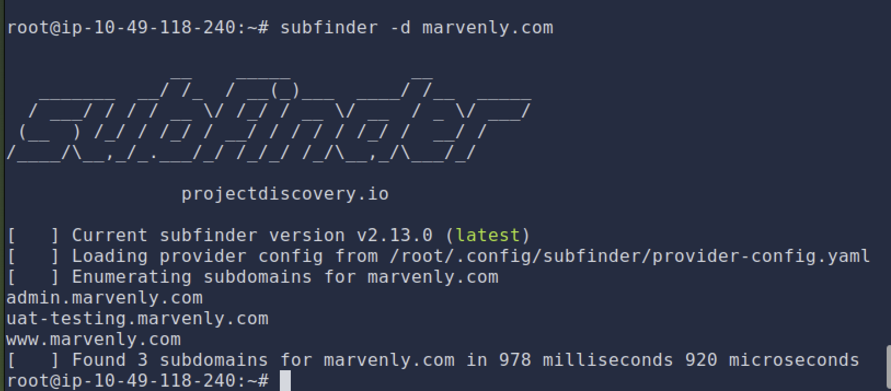
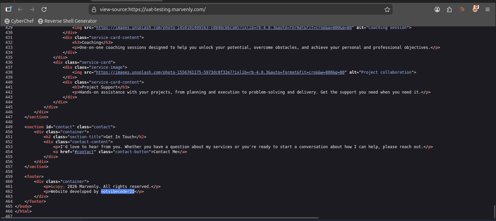
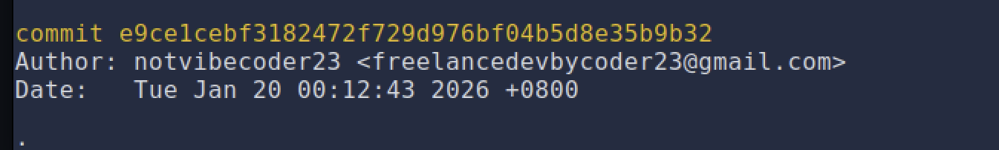
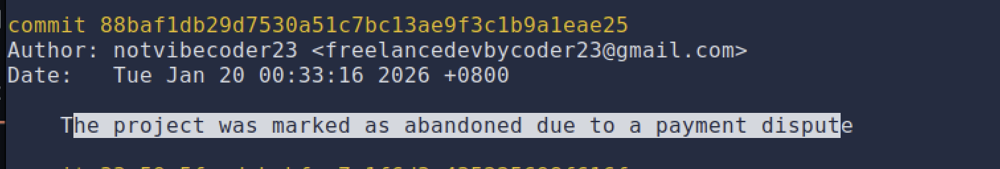

# Dev Diaries


---

## 1. What is the subdomain where the development version of the website is hosted?

Install subfinder:

```bash
go install github.com/projectdiscovery/subfinder/v2/cmd/subfinder@latest
```

> **Command not found fix:**
> ```bash
> export PATH=$PATH:$(go env GOPATH)/bin
> ```

Run:

```bash
subfinder -d marvenly.com
```



---

## 2. What is the GitHub username of the developer?

Go to `uat-testing.marvenly.com`, open the site → Right-click → **View Page Source**



---

## 3. What is the developer's email address?

Clone the repo and run:

```bash
git log
```



---

## 4. What reason did the developer mention in the commit history for removing the source code?



---

## 5. What is the value of the hidden flag?

