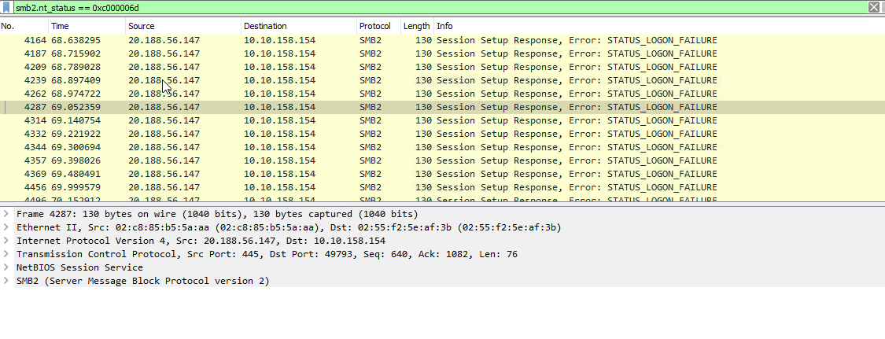
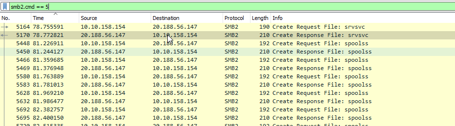
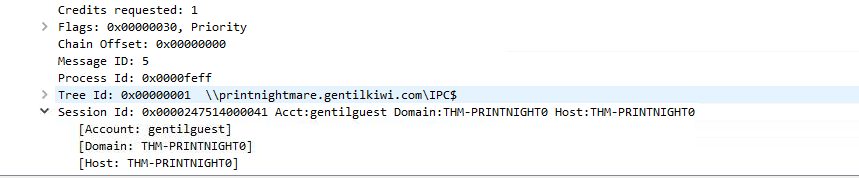
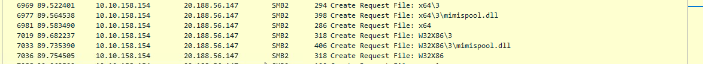
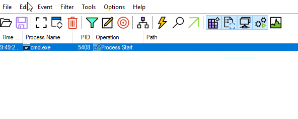
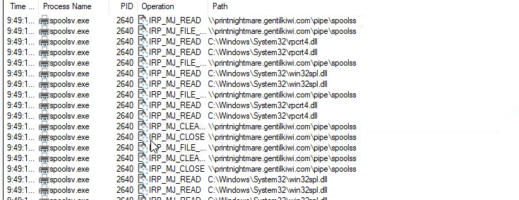

# 🛡️ PrintNightmare (CVE-2021-1675) Forensic Analysis

## 📝 Lab Overview
- **Target:** Windows Endpoint (THM-PRINTNIGHT0)
- **Vulnerability:** CVE-2021-1675 / CVE-2021-34527 (PrintNightmare)

---

## 🔍 Investigation
1. What remote address did the employee navigate to? 
    
2. Which user returns a STATUS_LOGON_FAILURE error?  
    ``` smb.2.cmd == 5 ```
     

3. Which user successfully connects to an SMB share?  
   
4. What is the first remote SMB share the endpoint connected to? What was the first filename? What was the second?    
Filter: ```smb2.cmd == 5``` (This filters for "Create" requests, which is how Windows asks for a file).



5. From which remote SMB share was malicious DLL obtained? What was the path to the remote folder for the first DLL? How about the second?  
smb2.cmd == 5 && smb2.filename
   * ```smb2.cmd == 5``` filters specifically for Create operations (opening/requesting a file).
   * ```smb2.filename``` ensures you only see packets that actually contain a name.  
Identifying the DLL
   * Look at the File column in the packet list and end with **.dll**  
       


6. What was the first location the malicious DLL was downloaded to on the endpoint? What was the second?


7. What was the process ID for the elevated command prompt? What was its parent process?    

* Add: Process Name is ```cmd.exe``` then click Add.
* Add: Operation is ```Process Start``` then click Add
    
* Add: PID 2640 Filter  

*Connect with me on [LinkedIn](https://www.linkedin.com/in/min-thant-tun-b76111294/) or follow my progress on [TryHackMe](https://tryhackme.com/p/MinThantTun).*
