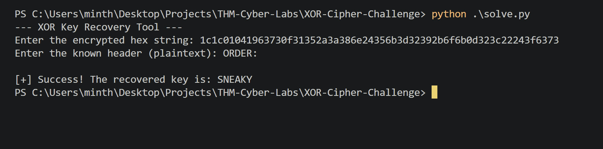
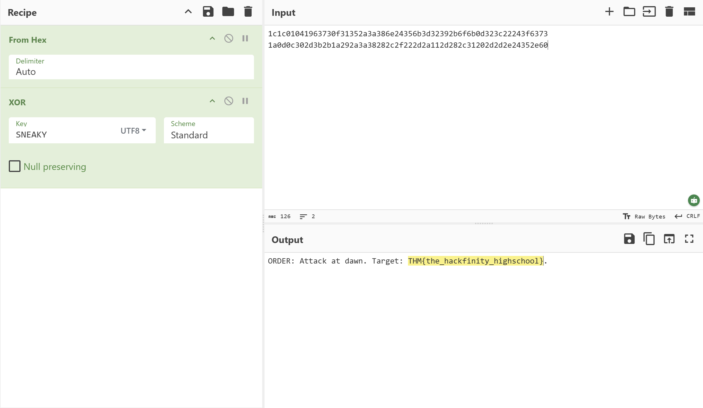

# XOR Cipher - Known Plaintext Attack

## 🚩 Challenge Overview
The objective was to decrypt a message encrypted with a **Repeating-Key XOR Cipher**. The intercepted ciphertext was provided in Hex format.

**Ciphertext:**
`1c1c01041963730f31352a3a386e24356b3d32392b6f6b0d323c22243f6373...`

## 🛡️ Vulnerability Analysis: Known Plaintext
The attacker made a critical mistake: every message starts with a standard header: `ORDER:`. 

In an XOR cipher, if you have the **Plaintext (P)** and the **Ciphertext (C)**, you can recover the **Key (K)** using the property:
$P \oplus C = K$

## 🛠️ Solution & Evidence

### Step 1: Recovering the Key (Python)
I wrote a Python script to automate the key recovery by XORing the known header against the ciphertext.

### Step 2: Decrypting the Message (CyberChef)
Using the recovered key `SNEAKY`, I used CyberChef to decode the full hex string into the final plaintext message.

*Connect with me on [LinkedIn](https://www.linkedin.com/in/min-thant-tun-b76111294/) or follow my progress on [TryHackMe](https://tryhackme.com/p/MinThantTun).*
